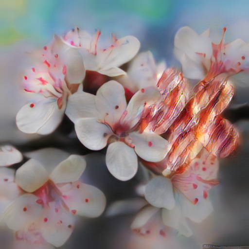

## Universal Style Transfer

This is the Pytorch implementation of [Universal Style Transfer via Feature Transforms](https://arxiv.org/pdf/1705.08086.pdf).

Official Torch implementation can be found [here](https://github.com/Yijunmaverick/UniversalStyleTransfer) and Tensorflow implementation can be found [here](https://github.com/eridgd/WCT-TF).

## Prerequisites
- [Pytorch](http://pytorch.org/)
- [torchvision](https://github.com/pytorch/vision)
- Pretrained encoder and decoder [models](https://drive.google.com/file/d/1M5KBPfqrIUZqrBZf78CIxLrMUT4lD4t9/view?usp=sharing) for image reconstruction only (download and uncompress them under models/)
- CUDA + CuDNN

## Prepare images
Simply put content and image pairs in `images/content` and `images/style` respectively. Note that correspoding conternt and image pairs should have same names.


## Style Transfer

```
python WCT.py --cuda
```

## Style Transfer with Mask

```
python WCT_mask.py --cuda --contentPath /images/wct_mask/content/img --stylePath /images/wct_mask/style/img --content_mask_Path /images/wct_mask/content/masks --style_mask_Path /images/wct_mask/style/masks
```

|content| content mask | style | style mask | result|
| -- |  -- | -- | -- | -- |
| |||||


## Results
<!--


--> 

### Acknowledgments
Many thanks to the author Yijun Li for his kind help.

### Reference
Li Y, Fang C, Yang J, et al. Universal Style Transfer via Feature Transforms[J]. arXiv preprint arXiv:1705.08086, 2017.
